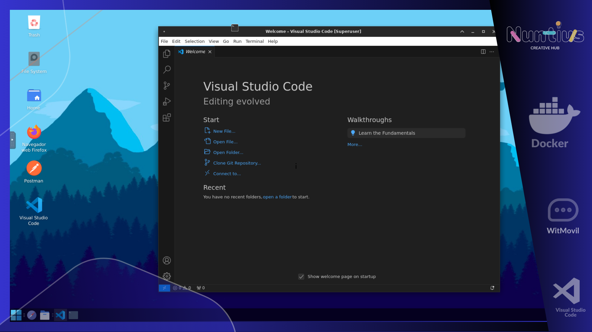

# VS Code Installation Script

This repository provides a Bash script to automate the installation and configuration of Visual Studio Code on Linux systems. It also sets up conveniences for Python development and optimizes the environment for a clean installation.



## Features

- Automatically detects the system architecture (x64 or arm64) and downloads the appropriate VS Code package.
- Installs VS Code with a custom desktop icon and sets the `--no-sandbox` flag for compatibility.
- Configures Python development tools, including:
  - `python3-setuptools`
  - `python3-venv`
  - `python3-virtualenv`
- Performs cleanup to minimize the image size and temporary files.

## Usage
# Quick Installation (Root)
```bash
apt install wget -y ; wget https://raw.githubusercontent.com/nuntius-dev/vs-code/refs/heads/main/install_vs_code.sh  ; chmod +x install_vs_code.sh ; ./install_vs_code.sh
```

# Installation with git clone
1. Clone the repository:
   ```bash
   git clone https://github.com/nuntius-dev/vs-code.git
   cd vs-code


2. Make the script executable:
   ```bash
   chmod +x install_vs_code.sh
   ```

3. Run the script:
   ```bash
   sudo ./install_vs_code.sh
   ```

## Script Details

### Installation of VS Code
The script dynamically detects the system architecture and fetches the corresponding `.deb` package for VS Code. It installs the package and ensures the desktop icon is properly set up.

### Python Development Tools
The following tools are installed to facilitate Python development:
- `python3-setuptools`: Simplifies the process of packaging Python projects.
- `python3-venv`: Creates isolated Python environments.
- `python3-virtualenv`: Provides additional flexibility for virtual environments.

### Cleanup Process
To maintain a clean environment, the script removes:
- Temporary files in `/tmp` and `/var/tmp`.
- Cached package lists in `/var/lib/apt/lists`.

### Customizations
The desktop icon is customized using a VS Code SVG icon downloaded from a public repository. Additionally, the `--no-sandbox` flag is added to ensure compatibility in restricted environments.

## Contributions

Feel free to submit issues or pull requests to improve the script. Contributions are welcome!

## License

This project is licensed under the MIT License. See the [LICENSE](LICENSE) file for details.

---

For any queries or suggestions, contact the repository [maintainer](https://github.com/kasmtech). 
